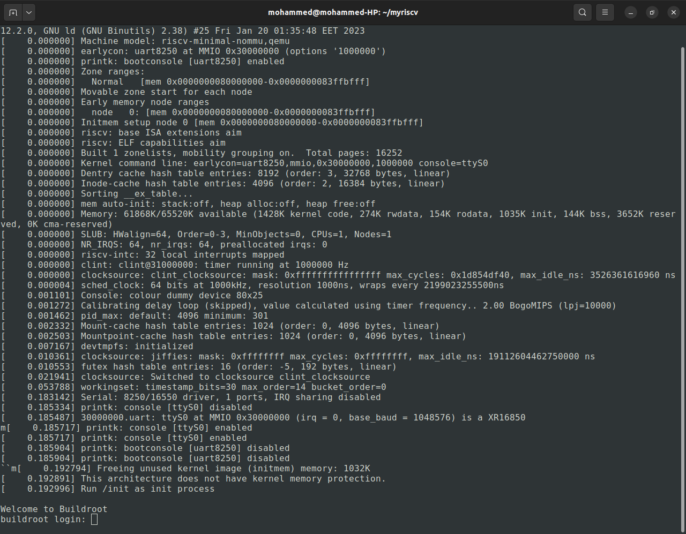

# RISCV-Emulator

## Overview
RISC-V emulator that is capable of running no-mmu linux.

> [Youtube Video]

## Getting started
- Download project files
```console
git clone https://github.com/mohammed0x00/RISCV-Emulator.git
```
- Execute **make** command to build the project then run the executable.
```console
cd RISCV-Emulator
make
./riscv-emulator
```
- The pre-compiled linux image **(./linux/Image)** will run.

> Note: You can build your own linux image and run it.

## Features
- Support RISC-V IMA Extensions.
- No MMU :(
- A 32-bit machine.
- Support interrupts.
- Support UART & CLINT.


## Screenshots

### Kernel Messages


## Helpful Links
- [riscv_em]
- [mini-rv32ima]
- [RISC-V International]


[mini-rv32ima]: <https://github.com/cnlohr/mini-rv32ima>
[riscv_em]: <https://github.com/franzflasch/riscv_em>
[RISC-V International]: <https://riscv.org>
[Youtube Video]: <https://youtu.be/urlDbGcUlYs>

